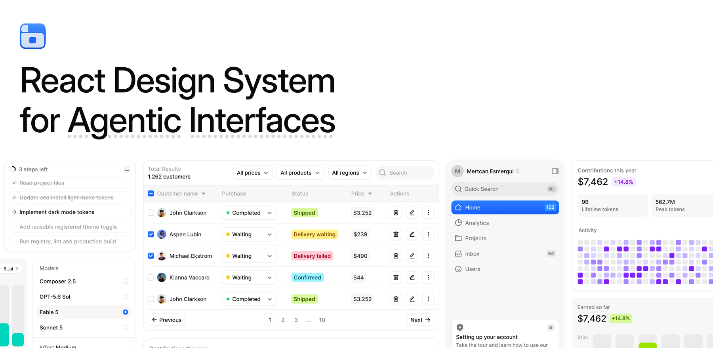

<a href="https://www.boardui.com"></a>

# BoardUI

Start your agentic app with BoardUI. This repository is the free tier of the [BoardUI](https://www.boardui.com) design system, every component as source, and its homepage is a working AI chat app on your own model key. Next.js App Router, React, Tailwind CSS v4. Deploy it in a click, or install any component into a project you already have.

[](https://vercel.com/new/clone?repository-url=https%3A%2F%2Fgithub.com%2Fmertcanesmergul%2Fboardui-starter&env=AI_API_KEY&envDescription=Your+model+provider+key%3A+OpenAI%2C+Anthropic%2C+Google%2C+OpenRouter%2C+or+Vercel+AI+Gateway.+The+provider+is+read+from+the+key+itself.&envLink=https%3A%2F%2Fwww.boardui.com%2Fcomponents%2Fchat-starter&project-name=boardui-chat-starter&repository-name=boardui-chat-starter)

Click the button, paste one API key when Vercel asks for it, and the first deploy already answers.

This repository is generated from BoardUI's source and takes no pull requests. See [CONTRIBUTING.md](CONTRIBUTING.md).

## What you get

- Every free BoardUI item, 59 in all, as source under `components/`, `styles/` and `utils/`: the base components, the application blocks, the tokens and the type scale. The catalogue is below.
- A streaming chat screen as the homepage: app sidebar, composer, thinking indicator, message actions, and a chat history rail kept in the visitor's own browser. No database.
- `app/api/chat/route.ts`, the runtime. It reads your key server-side only, streams replies with the Vercel AI SDK, and never exposes the key to the browser.
- BoardUI's design rules for coding agents in `AGENTS.md` and `.cursor/rules/`, so an agent building the next screen uses the same tokens and type scale.

## Bring your own key

One variable. The provider is read from the key itself:

| Key looks like | Provider | Default model |
| --- | --- | --- |
| `sk-ant-...` | Anthropic | claude-haiku-4-5 |
| `sk-or-...` | OpenRouter | openai/gpt-5-nano |
| `sk-...` | OpenAI | gpt-5.4-mini |
| `AIza...` | Google Gemini | gemini-2.5-flash |
| `vck_...` | Vercel AI Gateway | openai/gpt-5-nano |
| `gsk_...` | Groq | llama-3.3-70b-versatile |
| `xai-...` | xAI | grok-4-fast-non-reasoning |

Set `CHAT_MODEL` to use a different model. For Mistral or DeepSeek, whose keys have no recognisable shape, add `AI_PROVIDER=mistral` or `AI_PROVIDER=deepseek`. For any OpenAI-compatible server (Ollama, LM Studio, vLLM, LiteLLM, Together) set `AI_BASE_URL` and `CHAT_MODEL`. Every provider's usual variable (`OPENAI_API_KEY`, `ANTHROPIC_API_KEY`, ...) works too. See `.env.example`.

## Run it locally

```bash
npm install
cp .env.example .env.local   # then put your key in AI_API_KEY
npm run dev
```

## Components

### Application blocks

Composed screens and panels: sidebars, chat, tables, settings, cards.

| Component | What it is | Install |
| --- | --- | --- |
| Agent Chat | A working chat app: app sidebar, streaming replies, thinking indicator, a composer pill with stop control, a chat-history rail with local thread switching, and a setup notice when no provider key is set. | `npx boardui@latest add agent-chat` |
| Agent Log | Shared streaming-log machinery: the reveal ticker, the blur-in with its soft clipping edge, and the curved tree guide that draws itself. Behind Task List and Web Search. | `npx boardui@latest add agent-log` |
| [Agent Thinking](https://www.boardui.com/components/agent-thinking) | Agent thinking indicator for chat composers — dot wave, dot spin, stars, and infinity variants with a shimmering label and elapsed timer. | `npx boardui@latest add agent-thinking` |
| [Auth Card](https://www.boardui.com/components/auth-card) | Sign-in and sign-up cards with social providers stacked with labels or inline as icons, plus email fields and a CTA. | `npx boardui@latest add auth-card` |
| [Composer Loader](https://www.boardui.com/components/composer-loader) | Loading state that wraps a chat composer — an iridescent light band orbiting the rim with a soft inward bloom, fading in while the agent works. | `npx boardui@latest add composer-loader` |
| [Data Table](https://www.boardui.com/components/data-table) | TanStack-powered data table with sorting, selection, and pagination. | `npx boardui@latest add data-table` |
| Important Alerts Card | Scrollable alert feed with tinted icon circles and date pills. | `npx boardui@latest add important-alerts-card` |
| [Notification Center](https://www.boardui.com/components/notification-center) | Tabbed activity inbox with grouped notifications, unread state, avatars, status icons, and inline actions. | `npx boardui@latest add notification-center` |
| Patient Info Card | Profile card with avatar and label/value detail rows. | `npx boardui@latest add patient-info-card` |
| [Settings Modal](https://www.boardui.com/components/settings-modal) | Controlled multi-page settings dialog with General, Profile, Tools, and Storage views. | `npx boardui@latest add settings-modal` |
| [Sidebar](https://www.boardui.com/components/sidebar) | The floating dashboard sidebar with team menu, nav, announcement, and user menu. | `npx boardui@latest add sidebar` |
| [Stat Cards](https://www.boardui.com/components/stat-cards) | KPI stat card row with delta chips. | `npx boardui@latest add stat-cards` |
| [Theme Toggle](https://www.boardui.com/components/theme-toggle) | Manual light/dark control with a click-origin reveal, local persistence, and no system-theme dependency. | `npx boardui@latest add theme-toggle` |

### Base components

The everyday building blocks.

| Component | What it is | Install |
| --- | --- | --- |
| [Announcement](https://www.boardui.com/components/announcement) | Dismissible announcement card used in the sidebar footer. | `npx boardui@latest add announcement` |
| [Avatar](https://www.boardui.com/components/avatar) | Image or initials avatar in multiple sizes and tints. | `npx boardui@latest add avatar` |
| [Badge](https://www.boardui.com/components/badge) | Counter pills and the Kbd shortcut hint. | `npx boardui@latest add badge` |
| [Breadcrumb](https://www.boardui.com/components/breadcrumb) | Icon-capable breadcrumb trail. | `npx boardui@latest add breadcrumb` |
| [Button](https://www.boardui.com/components/button) | Primary, secondary, ghost, and danger buttons in three sizes with icon support. | `npx boardui@latest add button` |
| [Button Group](https://www.boardui.com/components/button-group) | Row of secondary-style buttons fused into one bordered control with hairline dividers and selectable items. | `npx boardui@latest add button-group` |
| [Carousel](https://www.boardui.com/components/carousel) | Gallery carousel built on CSS scroll-snap: swipe, arrows and a position indicator. | `npx boardui@latest add carousel` |
| [Checkbox](https://www.boardui.com/components/checkbox) | React Aria checkbox with animated tick and indeterminate state. | `npx boardui@latest add checkbox` |
| Checkbox Card | Bordered selectable card driven by a checkbox. | `npx boardui@latest add checkbox-card` |
| [Chip](https://www.boardui.com/components/chip) | Status/delta chips in bold and soft variants across the accent palette. | `npx boardui@latest add chip` |
| [Close Button](https://www.boardui.com/components/close-button) | Compact dismiss button for banners, modals, and chips. | `npx boardui@latest add close-button` |
| [Date Picker](https://www.boardui.com/components/date-picker) | Single-date picker with month navigation, built on React Aria. | `npx boardui@latest add date-picker` |
| [Date Range Picker](https://www.boardui.com/components/date-picker) | Two-month range picker sharing the date-picker chrome. | `npx boardui@latest add date-range-picker` |
| [Divider](https://www.boardui.com/components/divider) | Horizontal content divider with single-line, double-line, filled, and aligned variants. | `npx boardui@latest add divider` |
| [Dropdown](https://www.boardui.com/components/dropdown) | Composable popover menu (trigger, panel, groups, rows, dividers) built on React Aria — the recipe behind the sidebar team/account menus. | `npx boardui@latest add dropdown` |
| [File Upload](https://www.boardui.com/components/file-upload) | Drag-and-drop file upload with validation, animated progress, and a completion callback. | `npx boardui@latest add file-upload` |
| [Icon Button](https://www.boardui.com/components/icon-button) | Square icon-only button in two sizes. | `npx boardui@latest add icon-button` |
| [Input](https://www.boardui.com/components/input) | Text input with label, hint text, error states, and leading icon support. | `npx boardui@latest add input` |
| [Input OTP](https://www.boardui.com/components/input-otp) | One-time-code field with a monospace box per digit, paste distribution and autofill support. | `npx boardui@latest add input-otp` |
| Kbd | Keyboard shortcut hint pill. | `npx boardui@latest add kbd` |
| [Link Button](https://www.boardui.com/components/link-button) | Inline text action styled like a link — primary/secondary variants, three sizes, icon support, renders <a> or <button>. | `npx boardui@latest add link-button` |
| [Meeting Scheduler](https://www.boardui.com/components/date-picker) | Date + time-slot scheduler popover. | `npx boardui@latest add meeting-scheduler` |
| [Notification](https://www.boardui.com/components/notification) | Dismissible notification with status icons, avatars, action buttons, and timed countdown. | `npx boardui@latest add notification` |
| [Pagination](https://www.boardui.com/components/pagination) | Numbered pagination with prev/next and ellipsis collapsing. | `npx boardui@latest add pagination` |
| [Radio](https://www.boardui.com/components/radio) | React Aria radio group with the gradient selected dot, two sizes, and the bare RadioDot glyph for menu rows. | `npx boardui@latest add radio` |
| Radio Card | Bordered selectable card driven by a radio — the radio flavor of Checkbox Card. | `npx boardui@latest add radio-card` |
| [Segmented Control](https://www.boardui.com/components/segmented-control) | Pill-style segmented control (Weekly / Monthly / Yearly switchers). | `npx boardui@latest add segmented-control` |
| [Select](https://www.boardui.com/components/select) | React Aria select with styled trigger, non-modal popover, and free-form item content. | `npx boardui@latest add select` |
| [Slider](https://www.boardui.com/components/slider) | Single-value and min/max range sliders with exact-value bubbles and keyboard controls. | `npx boardui@latest add slider` |
| [Social Button](https://www.boardui.com/components/social-button) | Sign-in buttons for 24 providers, with brand logos, three colour treatments and an icon-only form. | `npx boardui@latest add social-button` |
| Status Dot | Colored status indicator dot used inside selects and tables. | `npx boardui@latest add status-dot` |
| [Switch](https://www.boardui.com/components/switch) | Skeuomorphic toggle switch in two sizes. | `npx boardui@latest add switch` |
| Switch Card | Bordered settings row driven by a switch. | `npx boardui@latest add switch-card` |
| [Table](https://www.boardui.com/components/table) | Static table primitives matching the dashboard tables. | `npx boardui@latest add table` |
| [Tabs](https://www.boardui.com/components/tabs) | Underline and pill tab variants built on React Aria. | `npx boardui@latest add tabs` |
| [Tooltip](https://www.boardui.com/components/tooltip) | Light-surface tooltip built on React Aria. | `npx boardui@latest add tooltip` |

### Foundations

Tokens, type scale, global styles, utilities, and the agent rules.

| Component | What it is | Install |
| --- | --- | --- |
| Agent rules | Always-on design rules for AI agents (semantic tokens, type scale, conventions), installed as a Cursor rule file. | `npx boardui@latest add rules` |
| Agent runtime | Streaming chat endpoint for agent templates: one AI_API_KEY from OpenAI, Anthropic, Google, OpenRouter, Groq, xAI or Vercel AI Gateway (or any OpenAI-compatible server by URL), a config probe for unconfigured deploys, and the message contract the BoardUI chat UI installs against. | `npx boardui@latest add agent-runtime` |
| Chevron icons | Custom chevron glyphs (select caret, sortable table headers) matching the Figma strokes. | `npx boardui@latest add chevrons` |
| cx utility | tailwind-merge wrapper aware of BoardUI's composite text styles, plus the sortCx helper. | `npx boardui@latest add cx` |
| Global styles | Tailwind entry css: dark-mode variant, base resets, component animations, and table styling. Imports theme.css and typography.css. | `npx boardui@latest add globals` |
| Logo | BoardUI brand mark placeholder — swap with your own logo component. | `npx boardui@latest add logo` |
| Theme tokens | Color primitives, semantic tokens (text/background/border/foreground/chart), radii, shadows, and button gradient utilities. | `npx boardui@latest add theme` |
| [Typography tokens](https://www.boardui.com/components/typography) | The full Figma type scale as composite text-{family}-{weight} Tailwind utilities. | `npx boardui@latest add typography` |
| useCountUp hook | Animated rolling number hook used by chart headline figures. | `npx boardui@latest add use-count-up` |
| useDismissOnOutsidePress hook | Closes React Aria popovers on outside press without swallowing the outside click. | `npx boardui@latest add use-dismiss-on-outside-press` |

## Install into an existing project

Every component in this repository also installs on its own, as source, into any Next.js project. BoardUI Pro adds the full-page templates and richer components on the same path.

### With an agent

BoardUI has an MCP server, so Claude Code, Cursor and any MCP client can browse the catalog and install for you. Add it once:

```bash
claude mcp add boardui -- npx -y boardui@latest mcp
```

Cursor and most other clients take the same server in their MCP config:

```json
{
  "mcpServers": {
    "boardui": { "command": "npx", "args": ["-y", "boardui@latest", "mcp"] }
  }
}
```

Then ask in plain words. "Install every free BoardUI component" installs the whole free catalog in one go. "Add a data table and stat cards to the dashboard" installs just those and wires them in. The rules in `AGENTS.md` keep whatever it builds on BoardUI's tokens and type scale. Setup for VS Code, Codex and the rest is at [boardui.com/mcp](https://www.boardui.com/mcp).

### With the CLI

```bash
npx boardui@latest list              # every component, one line each
npx boardui@latest add data-table    # one component and what it depends on
npx boardui@latest add --all         # everything in this repository
```

Pro components and templates need a licence key: `npx boardui@latest login <key>`, then `add` as usual. See [BoardUI Pro](https://www.boardui.com).

## Before going public

Requests bill to whoever owns the key. Put a rate limit in front of `/api/chat` before pointing the internet at a deployment with a live key.

## License

[MIT](LICENSE). Use it, change it, ship it, share it. BoardUI Pro components and templates are sold separately under the [BoardUI License](https://www.boardui.com/license).
